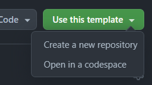

# Create a Repository (2 min)

:::info[If you are a Deutsche Telekom Employee]

Contact the OSPO to get a repository!

:::

## Create from Template

1. Navigate to https://github.com/telekom/reuse-template/.
2. At the top right click the green button "use this template".
3. Select "Create a new repository".   
   
4. Enter the repository details.
   1. **Do not** check "Include all branches" - that would include this documentation.
5. Click "Create repository".
6. You now have your own repo with the template contents.

## Use an existing Repo

If you already have a repository you can simply merge the contents of the template `main` branch into your existing repository.

:::tip

You can either do this manually by downloading the files and combining the contents of the directories, or by adding the template as a new remote to your local repo and merging the template `main` as you would any other remote branch.

:::

### Merge Tips

- If you have existing licensing information, you should (backup and) remove it 
- For the readme, you can simply append the template readme starting with "Code of Conduct" and everything below it to **the bottom** of your existing readme.
- For the .gitignore, simply take the contents of the template version and paste it **at the top** of your existing one.
