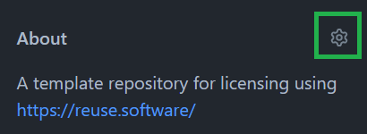

# Set up the Repo (5 min)

## Edit Repository details

1. At the top right next "About" click the options ("gear") icon.  
   
2. Edit the repository metadata as needed, but at least a description should be provided.
3. Click "Save Changes".

## Complete Readme 

1. Update the title of the README.md to your project's title.
2. Update the "About" section of the README.md to describe your project
   1. Additionally, you can add installation, deployment and usage documentation, etc.
3. If you have a readme already prepared you can simply replace the "About" section with your existing content.
4. Just make sure to keep the "Code of Conduct" and "Licensing" sections of the template unchanged at the bottom of your readme.

:::tip

See also [Create a Repository > Merge Tips](./create-repo.md#merge-tips)!

:::

## Add your code

1. Add your code to the repository, ensuring not to overwrite any existing files..

:::tip

See also [Create a Repository > Merge Tips](./create-repo.md#merge-tips)!

:::